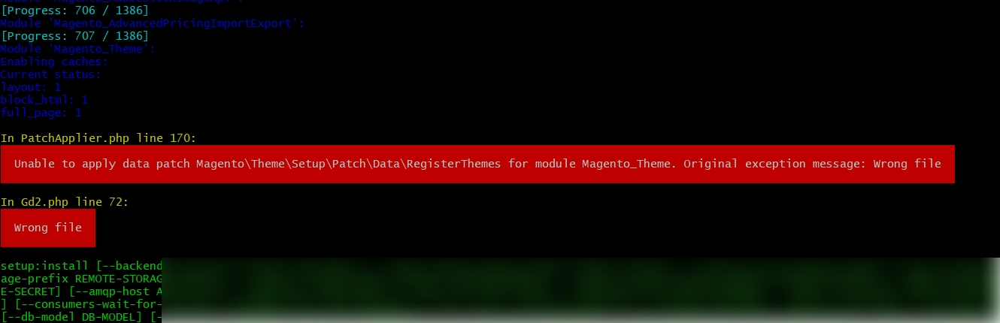
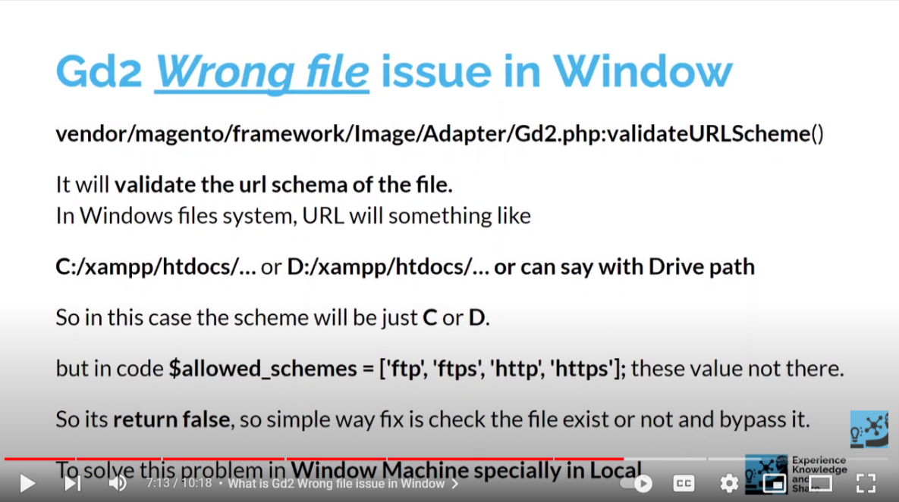

**Tested with Magento v2.3.x till Magento 2.4.3-p1**

# Magento 2 Gd2 Wrong file in Window
In PatchApplier.php line 170:  Unable to apply data patch `Magento\Theme\Setup\Patch\Data\RegisterThemes` for module `Magento_Theme`. Original exception message: Wrong file   

***In Gd2.php line 72: Wrong file***

# To fix apply shared patch

`git apply` [kanhaiya5590-M2.x.x-gd2-image-issue.patch](kanhaiya5590-M2.x.x-gd2-image-issue.patch)

 ***Note: considering we download the patch file on root of the project directory or update path in command accordingly, when executing command***
 
 
 # To revert the applied patch
 `git apply -R` [kanhaiya5590-M2.x.x-gd2-image-issue.patch](kanhaiya5590-M2.x.x-gd2-image-issue.patch)

# Why  Gd2 Wrong file issue occur in Window
As per Magento, `vendor/magento/framework/Image/Adapter/Gd2.php:validateURLScheme` function 
It will validating the url schema of the file. But in ***Windows files system***, 

In Windows files system, URL will something like `C:/xampp/htdocs/…` or `D:/xampp/htdocs/…`

So in this case the scheme will be just `C` or `D`. 

but in code `$allowed_schemes = ['ftp', 'ftps', 'http', 'https'];` not there in array. 

So its `return false`, o simple way fix is check the file exist or not and bypass it, To solve this problem in Window Machine specially in Local.

***Note:*** Please don't push these change to server(s), as changes will work fine in Linux, Can useful for Local developement for **Window Users** :).

# Video Reference to understand the concern in Window

